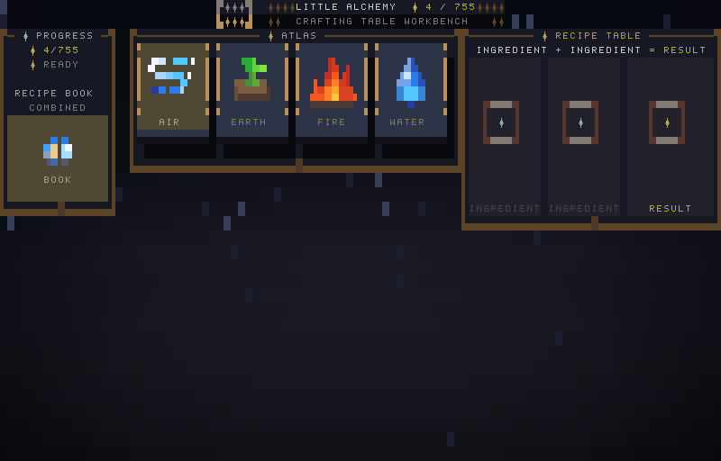
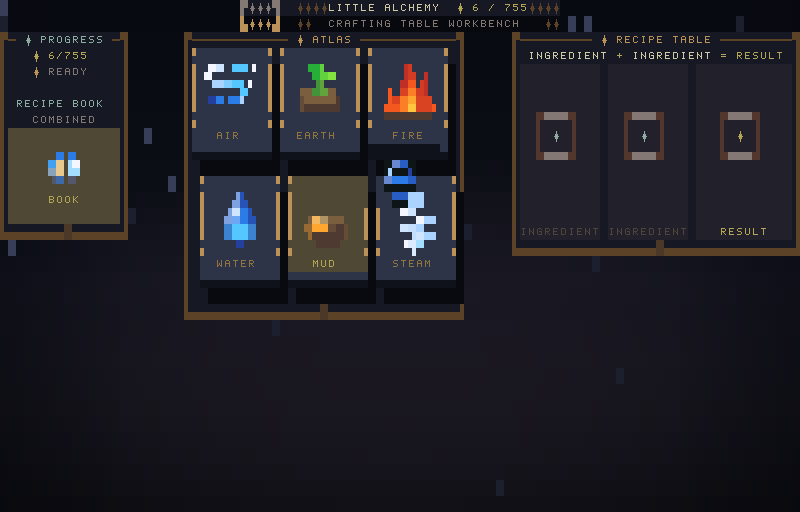
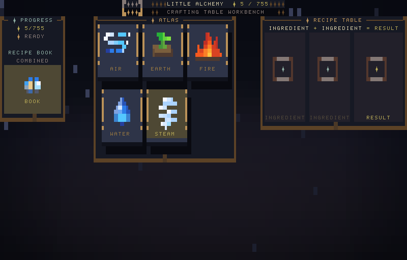
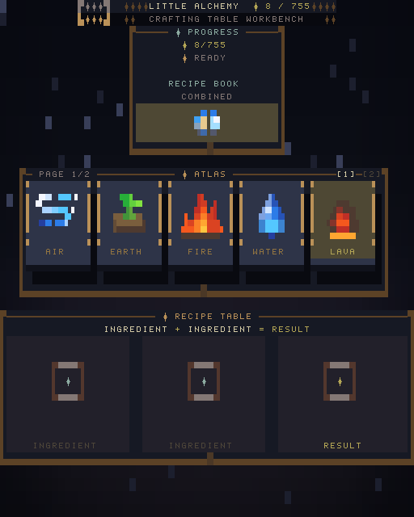
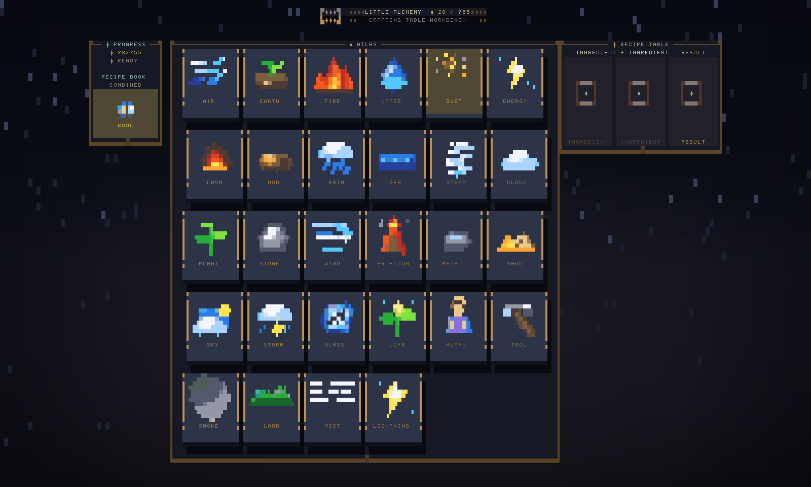

<h1 align="center">Alchemy TUI</h1>
<p align="center">
  <strong>A terminal alchemy crafting game with a 755-element recipe book, Ratatui UI, and pixel-art sprites.</strong>
</p>

<p align="center">
  <a href="https://github.com/kmelct/tui-alchemy/releases"></a>
  <a href="LICENSE"></a>
  
  
</p>

<p align="center">
  
</p>

## Table of contents

- [What is Alchemy?](#what-is-alchemy)
- [Quick start](#quick-start)
- [How the screen works](#how-the-screen-works)
- [How to play](#how-to-play)
- [Tutorial: make Steam](#tutorial-make-steam)
- [Responsive layouts](#responsive-layouts)
- [Maintain the project](#maintain-the-project)
- [Release checklist](#release-checklist)

## What is Alchemy?

Alchemy games are discovery puzzles. You start with a tiny set of elements, combine two at a time, and unlock new ingredients when the pair has a recipe.

`tui-alchemy` starts with the four classical elements:

| Starter | Use it to discover |
| --- | --- |
| `Air` | weather, motion, atmosphere, pressure |
| `Earth` | minerals, terrain, tools, life chains |
| `Fire` | heat, energy, lava, steam, metal chains |
| `Water` | mud, steam, oceans, life, weather chains |

The core rule is always:

```text
ingredient + ingredient = result
```

Early examples:

```text
Water + Fire = Steam
Water + Earth = Mud
Earth + Fire = Lava
Air + Earth = Dust
Air + Fire = Energy
```

Every discovery is added to the atlas immediately, so the puzzle expands from four starters into a 755-element catalog.

## Quick start

```sh
cargo run
```

Command-line help and package metadata:

```sh
cargo run -- --help
cargo run -- --version
```

Press `q` to quit.

## How the screen works

Use it as a three-step loop: **select an element → select a second element → get a result**.

| 1. Select an element | 2. Select a second | 3. Get the result |
| --- | --- | --- |
|  |  |  |

The left rail tracks progress, the center atlas holds discovered ingredients, and the right workbench resolves `ingredient + ingredient = result`.

## How to play

### Keyboard controls

1. Move through the atlas.
2. Select the first ingredient.
3. Select the second ingredient.
4. Watch the recipe table resolve the pair.
5. Use the newly discovered result as another ingredient.

| Key | Action |
| --- | --- |
| `Arrow` keys | Move through the atlas |
| `h`, `j`, `k`, `l` | Vim-style atlas movement |
| `Enter` | Select the highlighted element |
| `1`-`9` | Select a visible atlas slot directly |
| `PageUp`, `PageDown` | Move atlas pages |
| `[`, `]` | Move atlas pages |
| `Home`, `End` | Jump to the first or last visible discovery |
| `Esc`, `c` | Clear the current selection |
| `q` | Quit |

### Mouse controls

1. Click or drag an atlas card.
2. Drop it into the first or second recipe-table slot.
3. Drop a second ingredient into the remaining slot.
4. If the pair is a recipe, the result appears and joins the atlas.

<p align="center">
  
</p>

## Tutorial: make Steam

Start from a fresh game:

1. Select `Water`.
2. Select `Fire`.
3. The workbench resolves `Water + Fire = Steam`.
4. `Steam` appears in the result slot.
5. `Steam` is added to the atlas and can be used in later recipes.

<p align="center">
  
</p>

After Steam, keep branching through low-level recipes:

```text
Water + Earth = Mud
Earth + Fire = Lava
Air + Earth = Dust
Air + Fire = Energy
Water + Water = Puddle
Earth + Earth = Land
```

If a pair does nothing, keep experimenting. Some elements become useful only after you discover deeper ingredients.

## Responsive layouts

The UI is designed to remain playable across narrow, short, wide, and tall terminal sizes. The release screenshots in `docs/screenshots/` are deterministic visual QA fixtures.

| Narrow terminal | Large terminal |
| --- | --- |
|  |  |

Additional layout captures:

- [`docs/screenshots/07-height-24.png`](docs/screenshots/07-height-24.png)
- [`docs/screenshots/08-height-48.png`](docs/screenshots/08-height-48.png)

## Project layout

```text
src/                    Rust application, renderer, layout, catalog, and sprite code
assets/pixel-sprites/   Runtime pixel-art sprite atlas and manifest
data/little_alchemy.json
                        Canonical 755-element recipe catalog
docs/screenshots/       Curated screenshots used by this README and release notes
tests/                  Gameplay, layout, rendering, and regression tests
```

## Maintain the project

Use the narrowest check that covers your change, then run the complete release lane before publishing.

### Code and gameplay

```sh
cargo test
cargo ci-clippy
```

### Runtime sprites

Runtime sprites are checked in under `assets/pixel-sprites/`. Treat them as release assets unless a dedicated sprite workflow is added back to the project.

### Screenshot refresh

Run this after UI, layout, theme, sprite-fit, visual-effect, or renderer changes:

```sh
cargo run --example screenshot
```

The command writes fresh images to `output/screenshot/`. Copy release-quality images into `docs/screenshots/` so GitHub README screenshots stay current.

### Package check

Before a release, verify crate metadata and included files:

```sh
cargo package --list
cargo package
```

## Release checklist

1. Update `version` in `Cargo.toml`.
2. Add a matching entry to `CHANGELOG.md`.
3. Regenerate screenshots with `cargo run --example screenshot`.
4. Copy curated screenshots into `docs/screenshots/`.
5. Run `cargo test`.
6. Run `cargo ci-clippy`.
7. Run `cargo package`.
8. Commit the release changes.
9. Tag the release commit, push it, and create the GitHub release from `docs/release-v0.1.0.md`.

## License

MIT. See [`LICENSE`](LICENSE).
