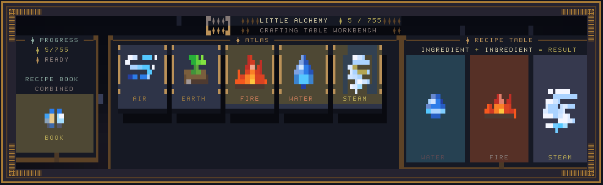
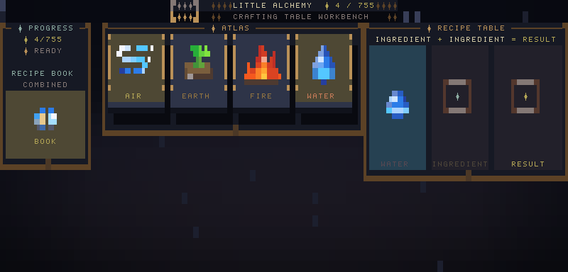
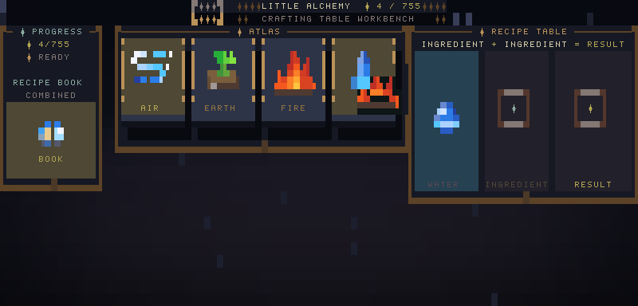
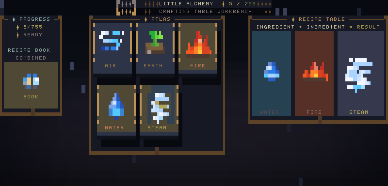
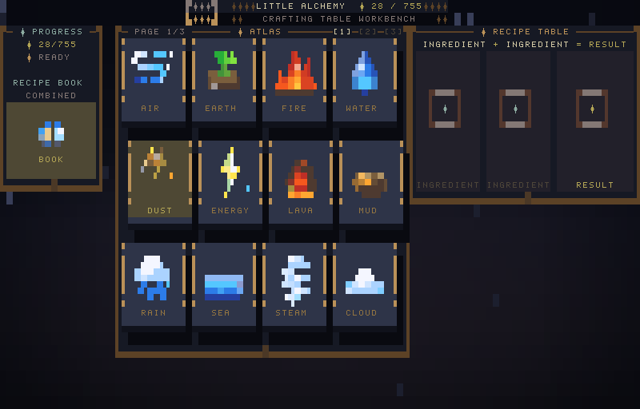
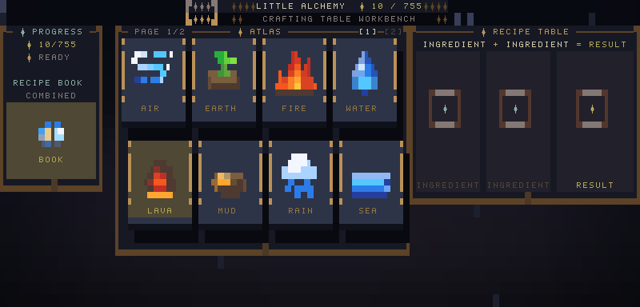
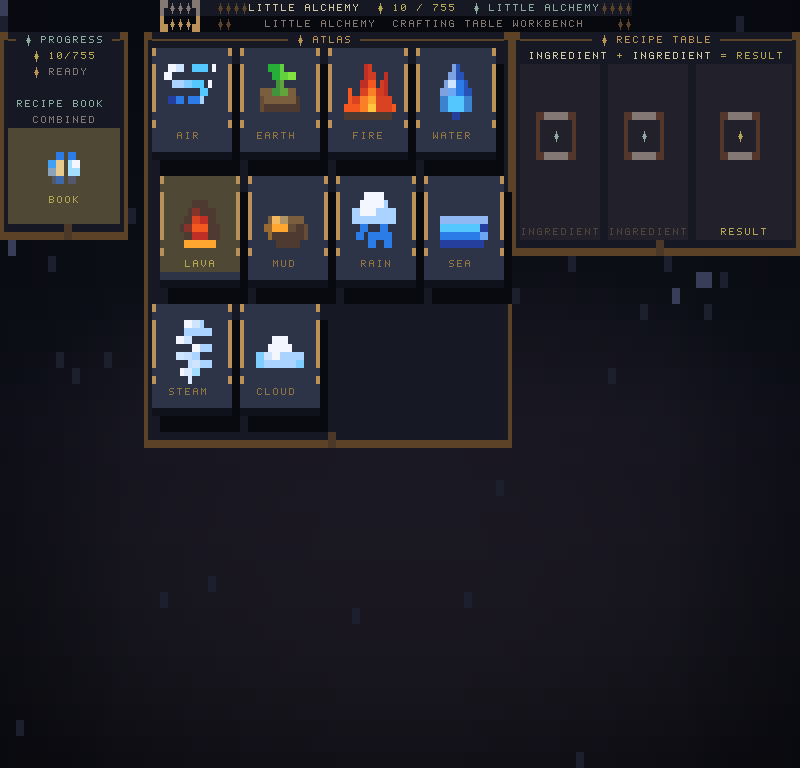

# Alchemy TUI user guide

Use this page as the player-facing README for controls, reset, installation, and visual walkthroughs.

## In-game menu

Press `m` to open the minimal game menu.

| Menu item | Action |
| --- | --- |
| `resume` | Close the menu and return to the board. |
| `controls` | Open the controls submenu. Keep general controls there instead of crowding the main menu. |
| `reset game` | Open reset confirmation. Press `Enter` again to reset discoveries to the four starters, or `Esc` to go back. |

## Controls submenu

| Key or input | Action |
| --- | --- |
| `Arrow` keys, `h` `j` `k` `l` | Move through the atlas. |
| `Enter` | Select the highlighted element or menu item. |
| `1`-`9` | Select a visible atlas slot directly. |
| Drag or click | Move ingredients into recipe slots. |
| `m` | Open or close the menu. |
| `Esc` | Back out of a submenu, close the menu, or clear the current selection during play. |
| `q` | Quit. |

## Visual walkthrough

| Step | What to do | Screenshot |
| --- | --- | --- |
| Start | Open the game and review the atlas, progress rail, and recipe table. |  |
| Pick first ingredient | Select `Water` from the atlas. |  |
| Pick second ingredient | Select or drag `Fire` into the second recipe slot. |  |
| Read the result | `Water + Fire` resolves into `Steam`, which joins the atlas. |  |
| Keep exploring | Use new elements as ingredients for deeper recipes. |  |

## Layout examples

| Terminal shape | Screenshot |
| --- | --- |
| Narrow |  |
| Large |  |
| Short |  |
| Tall |  |

## Other user documents

| File | Use |
| --- | --- |
| [`install.md`](install.md) | Install with the hosted script, Cargo, or binary archives. |
| [`release-v0.2.0.md`](release-v0.2.0.md) | Current release notes. |
| [`release-v0.1.0.md`](release-v0.1.0.md) | Previous release notes. |
